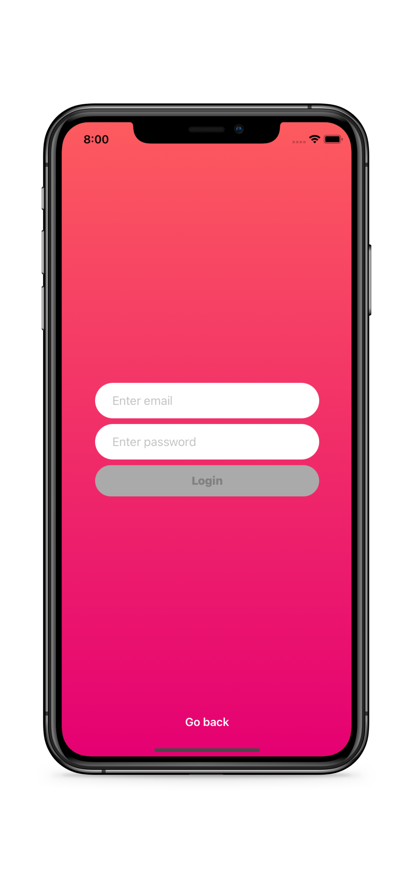
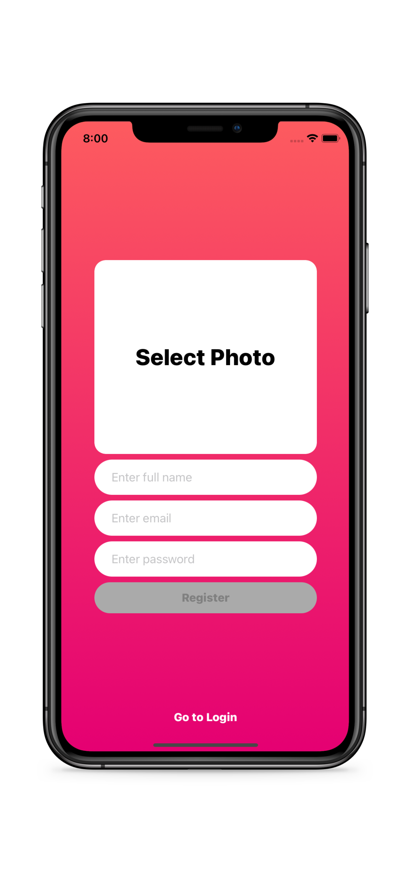
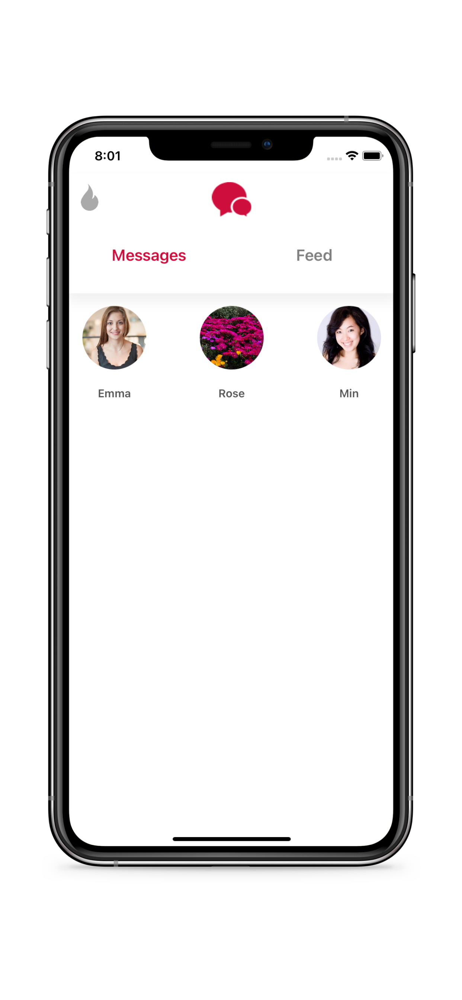
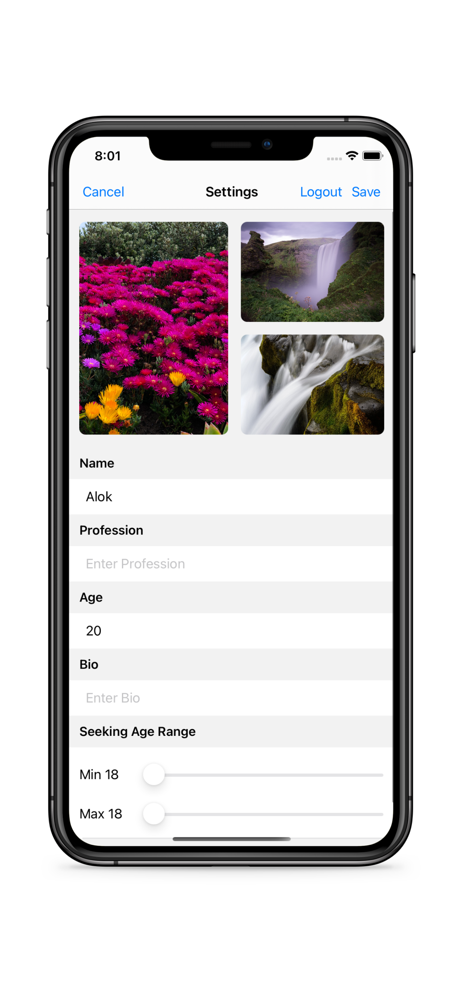

# BMI Calculator App

BMI Calculator is a an IOS App that calculates your Body Mass Index (BMI), and it gives you feedback on it.

## Usage

1. Input your height and weight using the slider
1. Press Calculate
1. Press Re-calculate if you need to adjust your height and weight.

## Contributing
Pull requests are welcome. For any changes, please open an issue first to discuss what you would like to change.
