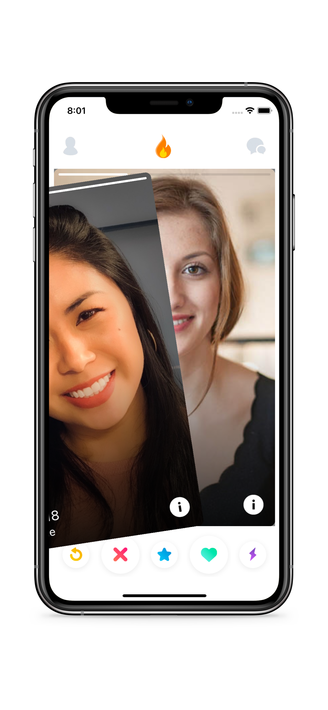
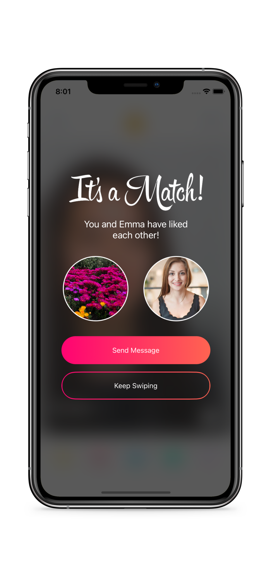

# Tinder Clone App

Tinder Clone is a clone of the popular app Tinder. It is built using Firebase and implements Bindables to make the code more readable.

## Usage

1. Register or Login from the front screen
1. Start Swiping!
1. Message anyone you match with

## Contributing
Pull requests are welcome. For any changes, please open an issue first to discuss what you would like to change.
